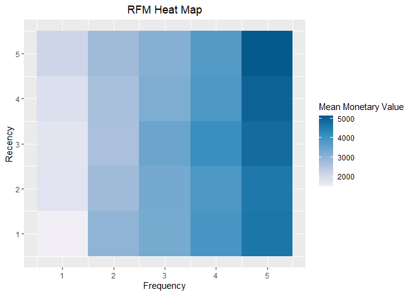
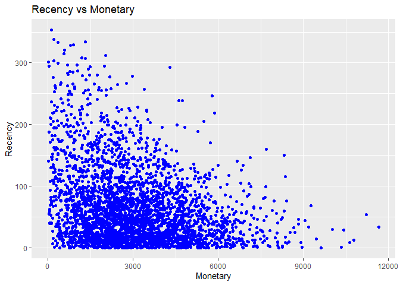
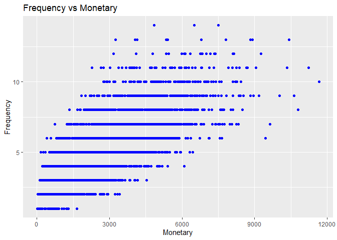
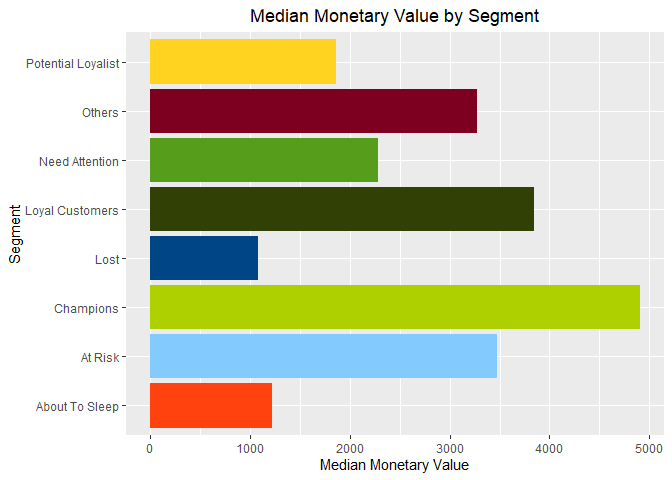
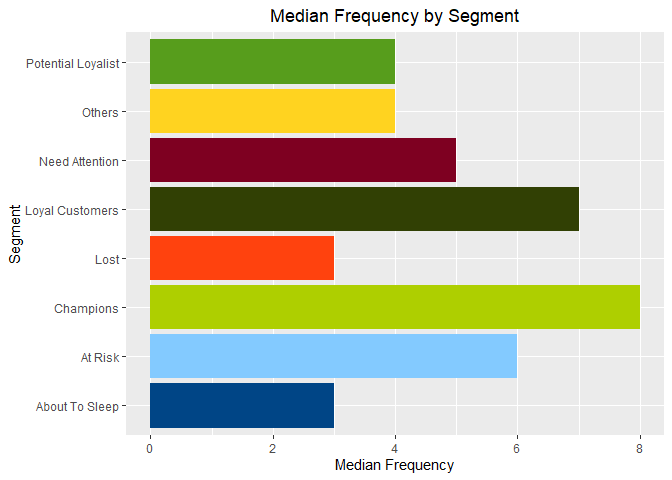
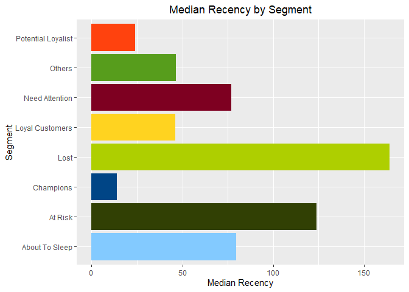

RFM Analysis: The case of Sproket Central
================
Njabulo Hlabangana
2023-02-05

## Introduction

**RFM (Recency, Frequency & Monetary value)** analysis is a powerful and
widely used marketing technique. It used to segment customers according
to how recently they last made a purchase, how frequently they purchased
over the period in question as well as the total monetary value of their
purchases over the same period. Customers are scored/ranked on those
three criteria. Customers with high recency, high frequency and high
monetary value are given high scores. The logic being that customers who
made a purchase recently are more likely to make another purchase than
those who last purchased a long time ago. Also, customers who make more
frequent purchases are more likely to keep making more purchases in the
future than those who rarely buy. Similarly, those who make purchases of
high monetary value can be reasonably expected to make more purchases
than those who make only small monetary value purchases.

Each criteria is typically scored on a scale of 1-5 with 1 being the
lowest and 5 the highest. For instance a customer who last made a
purchase a long time ago will be given a recency score of 1 while the
one who last purchased recently will get a score of 5. These scores are
then combined to come up with a 3 digit RFM score. As an example, a
customer who bought most recently, buys more frequently and makes high
ticket purchases will get an RFM score of 555 while the one on the
opposite end of the spectrum will get a score of 111. There is a whole
continuum of RFM scores in between those two extremes. It goes without
saying that a customer with an RFM score of 111 needs a different
marketing approach from a customer with a score of 555. RFM analysis
helps with this segmentation in ways that optimize marketing efforts.

The data set set contains information about bicycle and other ancillary
product transactions made by customers of a seller known as Sproket
central.

*All the data cleansing was conduct in excel as I worked on getting it
ready for visualization in Tableau. This mainly involved the removal of
records that missing critical information like customer ID, age etc*

## Loading the necessary packages

``` r
library(tidyverse)
library(rfm)
library(kableExtra)
```

## Dataset

The dataset used in this project was obtained from the KPMG virtual case
data analyst experience program which I completed in 2022. RFM analysis
was not part of the program but the dataset lends itself well to this
kind of analysis hence I decided to use it in the project.

    ##   transaction_id product_id customer_id transaction_date online_order
    ## 1              1          2        2950       25/02/2017      Instore
    ## 2              2          3        3120       21/05/2017       Online
    ## 3              3         37         402       16/10/2017      Instore
    ## 4              4         88        3135       31/08/2017      Instore
    ## 5              5         78         787       01/10/2017       Online
    ## 6              6         25        2339       08/03/2017       Online
    ##   order_status          brand product_line product_class product_size
    ## 1     Approved          Solex     Standard        medium       medium
    ## 2     Approved  Trek Bicycles     Standard        medium        large
    ## 3     Approved     OHM Cycles     Standard           low       medium
    ## 4     Approved Norco Bicycles     Standard        medium       medium
    ## 5     Approved Giant Bicycles     Standard        medium        large
    ## 6     Approved Giant Bicycles         Road        medium       medium
    ##   list_price standard_cost  Profit product_first_sold_date Date.Of.Birth Age
    ## 1      71.49        $53.62   17.87                   41245    11/01/1955  62
    ## 2    2091.47       $388.92 1702.55                   41701    04/02/1979  38
    ## 3    1793.43       $248.82 1544.61                   36361    03/06/1977  40
    ## 4    1198.46       $381.10  817.36                   36145    14/01/1962  56
    ## 5    1765.30       $709.48 1055.82                   42226    15/12/1996  21
    ## 6    1538.99       $829.65  709.34                   39031    28/12/1958  58
    ##      Wealth.Segment Deceased.Indicator Car_Ownership Gender           State
    ## 1     Mass Customer                  N           Yes   Male        Victoria
    ## 2     Mass Customer                  N           Yes Female New South Wales
    ## 3 Affluent Customer                  N            No   Male New South Wales
    ## 4     Mass Customer                  N            No   Male New South Wales
    ## 5 Affluent Customer                  N           Yes Female New South Wales
    ## 6 Affluent Customer                  N           Yes   Male New South Wales
    ##      Name              Address
    ## 1 Kristos    984 Hoepker Court
    ## 2  Lauree      4 Shopko Circle
    ## 3   Berne   586 Miller Parkway
    ## 4   Titus  1617 Harper Parkway
    ## 5   Norma   0601 Stephen Place
    ## 6  Damien 7174 Thackeray Point

## Removing Unnecessary Columns

The data set includes a lot of columns that are unnecessary for the kind
of analysis that will be conducted. Only the transaction date, profit
and customer id columns will be kept. The monetary value part of RFM
will be based on the profit obtained form the transactions made by the
customer not just revenue.

``` r
rfm.clean <- rfm.data %>% select(customer_id,transaction_date,Profit)
head(rfm.clean)
```

    ##   customer_id transaction_date  Profit
    ## 1        2950       25/02/2017   17.87
    ## 2        3120       21/05/2017 1702.55
    ## 3         402       16/10/2017 1544.61
    ## 4        3135       31/08/2017  817.36
    ## 5         787       01/10/2017 1055.82
    ## 6        2339       08/03/2017  709.34

**Making sure that we have the right data types for the columns.**

``` r
rfm.clean$transaction_date <- as.Date(rfm.clean$transaction_date,format = "%d/%m/%Y")
rfm.clean$customer_id <- as.character(rfm.clean$customer_id)
rfm.clean$Profit <- as.numeric(rfm.clean$Profit)
head(rfm.clean)
```

    ##   customer_id transaction_date  Profit
    ## 1        2950       2017-02-25   17.87
    ## 2        3120       2017-05-21 1702.55
    ## 3         402       2017-10-16 1544.61
    ## 4        3135       2017-08-31  817.36
    ## 5         787       2017-10-01 1055.82
    ## 6        2339       2017-03-08  709.34

## Choosing the Date of Analysis

The last date of transaction will be used as the date of analysis. The
following line of code extracts that date.

``` r
analysis_date <- as.Date(max(rfm.clean$transaction_date))
analysis_date
```

    ## [1] "2017-12-30"

## Analysis

The rf_table_order function of the rfm package will be used to perfom
the actual analysis. The arguments taken by this function are the
dataset itself, the customer id, transaction date, monetary value (which
is profit in this case) as well as the analysis date. The analysis is
based on the cleaned rfm.clean dataset as obtained above.

``` r
rfm_outcome <- rfm_table_order(rfm.clean,customer_id,transaction_date,Profit,analysis_date)
head(rfm_outcome$rfm,10) %>% kable() %>% 
  kable_classic_2()
```

<table class=" lightable-classic-2" style="font-family: &quot;Arial Narrow&quot;, &quot;Source Sans Pro&quot;, sans-serif; margin-left: auto; margin-right: auto;">
<thead>
<tr>
<th style="text-align:left;">
customer_id
</th>
<th style="text-align:left;">
date_most_recent
</th>
<th style="text-align:right;">
recency_days
</th>
<th style="text-align:right;">
transaction_count
</th>
<th style="text-align:right;">
amount
</th>
<th style="text-align:right;">
recency_score
</th>
<th style="text-align:right;">
frequency_score
</th>
<th style="text-align:right;">
monetary_score
</th>
<th style="text-align:right;">
rfm_score
</th>
</tr>
</thead>
<tbody>
<tr>
<td style="text-align:left;">
1
</td>
<td style="text-align:left;">
2017-12-23
</td>
<td style="text-align:right;">
7
</td>
<td style="text-align:right;">
11
</td>
<td style="text-align:right;">
3018.09
</td>
<td style="text-align:right;">
5
</td>
<td style="text-align:right;">
5
</td>
<td style="text-align:right;">
3
</td>
<td style="text-align:right;">
553
</td>
</tr>
<tr>
<td style="text-align:left;">
10
</td>
<td style="text-align:left;">
2017-11-17
</td>
<td style="text-align:right;">
43
</td>
<td style="text-align:right;">
5
</td>
<td style="text-align:right;">
3358.28
</td>
<td style="text-align:right;">
3
</td>
<td style="text-align:right;">
2
</td>
<td style="text-align:right;">
4
</td>
<td style="text-align:right;">
324
</td>
</tr>
<tr>
<td style="text-align:left;">
100
</td>
<td style="text-align:left;">
2017-12-19
</td>
<td style="text-align:right;">
11
</td>
<td style="text-align:right;">
2
</td>
<td style="text-align:right;">
877.40
</td>
<td style="text-align:right;">
5
</td>
<td style="text-align:right;">
1
</td>
<td style="text-align:right;">
1
</td>
<td style="text-align:right;">
511
</td>
</tr>
<tr>
<td style="text-align:left;">
1000
</td>
<td style="text-align:left;">
2017-12-30
</td>
<td style="text-align:right;">
0
</td>
<td style="text-align:right;">
9
</td>
<td style="text-align:right;">
5383.48
</td>
<td style="text-align:right;">
5
</td>
<td style="text-align:right;">
5
</td>
<td style="text-align:right;">
5
</td>
<td style="text-align:right;">
555
</td>
</tr>
<tr>
<td style="text-align:left;">
1001
</td>
<td style="text-align:left;">
2017-11-18
</td>
<td style="text-align:right;">
42
</td>
<td style="text-align:right;">
7
</td>
<td style="text-align:right;">
2884.19
</td>
<td style="text-align:right;">
3
</td>
<td style="text-align:right;">
4
</td>
<td style="text-align:right;">
3
</td>
<td style="text-align:right;">
343
</td>
</tr>
<tr>
<td style="text-align:left;">
1002
</td>
<td style="text-align:left;">
2017-07-28
</td>
<td style="text-align:right;">
155
</td>
<td style="text-align:right;">
4
</td>
<td style="text-align:right;">
2254.56
</td>
<td style="text-align:right;">
1
</td>
<td style="text-align:right;">
1
</td>
<td style="text-align:right;">
2
</td>
<td style="text-align:right;">
112
</td>
</tr>
<tr>
<td style="text-align:left;">
1003
</td>
<td style="text-align:left;">
2017-11-13
</td>
<td style="text-align:right;">
47
</td>
<td style="text-align:right;">
9
</td>
<td style="text-align:right;">
5300.38
</td>
<td style="text-align:right;">
3
</td>
<td style="text-align:right;">
5
</td>
<td style="text-align:right;">
5
</td>
<td style="text-align:right;">
355
</td>
</tr>
<tr>
<td style="text-align:left;">
1004
</td>
<td style="text-align:left;">
2017-06-10
</td>
<td style="text-align:right;">
203
</td>
<td style="text-align:right;">
6
</td>
<td style="text-align:right;">
3600.94
</td>
<td style="text-align:right;">
1
</td>
<td style="text-align:right;">
3
</td>
<td style="text-align:right;">
4
</td>
<td style="text-align:right;">
134
</td>
</tr>
<tr>
<td style="text-align:left;">
1005
</td>
<td style="text-align:left;">
2017-07-24
</td>
<td style="text-align:right;">
159
</td>
<td style="text-align:right;">
5
</td>
<td style="text-align:right;">
4365.25
</td>
<td style="text-align:right;">
1
</td>
<td style="text-align:right;">
2
</td>
<td style="text-align:right;">
4
</td>
<td style="text-align:right;">
124
</td>
</tr>
<tr>
<td style="text-align:left;">
1006
</td>
<td style="text-align:left;">
2017-11-23
</td>
<td style="text-align:right;">
37
</td>
<td style="text-align:right;">
8
</td>
<td style="text-align:right;">
4687.53
</td>
<td style="text-align:right;">
3
</td>
<td style="text-align:right;">
5
</td>
<td style="text-align:right;">
5
</td>
<td style="text-align:right;">
355
</td>
</tr>
</tbody>
</table>

The analysis calculates and assigns the recency, frequency and monetary
value scores for each customer. It also calculates the actual total
monetary value of each customer’s purchases during the analysis period.

## RFM Data Visualization

The first visualization is the RFM Heat Map. This show how the three
criteria interact. In this case it clear that monetary value increases
as both recency and frequency increase with the highest (darkest shade)
occuring at the top right hand corner and the least at the bottom left
hand corner.

``` r
rfm_heatmap(rfm_outcome)
```

<!-- -->

## The Recency vs Monetary Value Plot

The Recency vs Monetary graph shows that most of the monetary value is
associated with the more recent purchasers.The highest value seems to be
associated with customers that made a purchase lees than 100 days ago
with total profit between 15000 3500 dollars.

``` r
rfm_rm_plot(rfm_outcome)
```

<!-- -->

## The Frequency vs Monetary

The Frequency vs Monetary plot show a positive correlation between
monetary value and frequency - higher frequency is associated with
higher monetary value.

``` r
rfm_fm_plot(rfm_outcome)
```

<!-- -->

## Segmentation

This is the part where the RFM score is actually used to segment
customers. In the this case the score is used to come up with 10
possible segments namely, Champions, Loyal customers, Potential
Loyalists, New Customers, Promising Customers, Customers that need
attention, customers that are about to “sleep”, at risk customers,
customers that the company cannot afford to lose and those that are
lost.

I will explain a few of the segments here. Champions are the customers
with the highest RFM score. As indicated in the code below, champions
have a minimum score of 4 on the of the RFM criteria. In other other
words, they are those who bought most recently, have a history of buying
frequently and make high ticket purchases. At the opposite end of the
spectrum we have the lost customers. These are the ones who last made a
purchase along time ago, they rarely buy and when the do buy they buy
low value items.

The other very important segments is that of **At Risk** customers.
These ones last made purchases a long time ago but hitherto they were
frequent buyers and were making relatively high value purchases.They
therefore have a low recency score - 1 in this case and high scores on
frequency and monetary value - between 2 and 5 in this case. The company
is therefore at risk of losing these, otherwise high value customers
hence the name of the category. A similar explanation can be extended to
the **“Cant Lose Them”** segment except that these have even higher
frequency and monetary scores making them even more valuable to the
business. All the categories cabe explained along similar lines.

``` r
segment_names <- c("Champions", "Loyal Customers", "Potential Loyalist",
  "New Customers", "Promising", "Need Attention", "About To Sleep",
  "At Risk", "Can't Lose Them", "Lost")


recency_lower <- c(4, 2, 3, 4, 3, 2, 2, 1, 1, 1)
recency_upper <- c(5, 5, 5, 5, 4, 3, 3, 2, 1, 2)
frequency_lower <- c(4, 3, 1, 1, 1, 2, 1, 2, 4, 1)
frequency_upper <- c(5, 5, 3, 1, 1, 3, 2, 5, 5, 2)
monetary_lower <- c(4, 3, 1, 1, 1, 2, 1, 2, 4, 1)
monetary_upper <- c(5, 5, 3, 1, 1, 3, 2, 5, 5, 2)

# We use the segments and the bounds we previously established to group our users into different segments
segment <- rfm_segment(rfm_outcome,
                       segment_names,
                       recency_lower,
                       recency_upper,
                       frequency_lower, 
                       frequency_upper, 
                       monetary_lower,
                       monetary_upper)
```

The table below is the outcome of the segmentation exercise done above.
As shown in the table, each customer now has been allocated to a
segment.

``` r
library(kableExtra)
head(segment) %>% 
  kable() %>% 
  kable_classic_2()
```

<table class=" lightable-classic-2" style="font-family: &quot;Arial Narrow&quot;, &quot;Source Sans Pro&quot;, sans-serif; margin-left: auto; margin-right: auto;">
<thead>
<tr>
<th style="text-align:left;">
customer_id
</th>
<th style="text-align:left;">
segment
</th>
<th style="text-align:right;">
rfm_score
</th>
<th style="text-align:right;">
transaction_count
</th>
<th style="text-align:right;">
recency_days
</th>
<th style="text-align:right;">
amount
</th>
<th style="text-align:right;">
recency_score
</th>
<th style="text-align:right;">
frequency_score
</th>
<th style="text-align:right;">
monetary_score
</th>
</tr>
</thead>
<tbody>
<tr>
<td style="text-align:left;">
1
</td>
<td style="text-align:left;">
Loyal Customers
</td>
<td style="text-align:right;">
553
</td>
<td style="text-align:right;">
11
</td>
<td style="text-align:right;">
7
</td>
<td style="text-align:right;">
3018.09
</td>
<td style="text-align:right;">
5
</td>
<td style="text-align:right;">
5
</td>
<td style="text-align:right;">
3
</td>
</tr>
<tr>
<td style="text-align:left;">
10
</td>
<td style="text-align:left;">
Others
</td>
<td style="text-align:right;">
324
</td>
<td style="text-align:right;">
5
</td>
<td style="text-align:right;">
43
</td>
<td style="text-align:right;">
3358.28
</td>
<td style="text-align:right;">
3
</td>
<td style="text-align:right;">
2
</td>
<td style="text-align:right;">
4
</td>
</tr>
<tr>
<td style="text-align:left;">
100
</td>
<td style="text-align:left;">
Potential Loyalist
</td>
<td style="text-align:right;">
511
</td>
<td style="text-align:right;">
2
</td>
<td style="text-align:right;">
11
</td>
<td style="text-align:right;">
877.40
</td>
<td style="text-align:right;">
5
</td>
<td style="text-align:right;">
1
</td>
<td style="text-align:right;">
1
</td>
</tr>
<tr>
<td style="text-align:left;">
1000
</td>
<td style="text-align:left;">
Champions
</td>
<td style="text-align:right;">
555
</td>
<td style="text-align:right;">
9
</td>
<td style="text-align:right;">
0
</td>
<td style="text-align:right;">
5383.48
</td>
<td style="text-align:right;">
5
</td>
<td style="text-align:right;">
5
</td>
<td style="text-align:right;">
5
</td>
</tr>
<tr>
<td style="text-align:left;">
1001
</td>
<td style="text-align:left;">
Loyal Customers
</td>
<td style="text-align:right;">
343
</td>
<td style="text-align:right;">
7
</td>
<td style="text-align:right;">
42
</td>
<td style="text-align:right;">
2884.19
</td>
<td style="text-align:right;">
3
</td>
<td style="text-align:right;">
4
</td>
<td style="text-align:right;">
3
</td>
</tr>
<tr>
<td style="text-align:left;">
1002
</td>
<td style="text-align:left;">
Lost
</td>
<td style="text-align:right;">
112
</td>
<td style="text-align:right;">
4
</td>
<td style="text-align:right;">
155
</td>
<td style="text-align:right;">
2254.56
</td>
<td style="text-align:right;">
1
</td>
<td style="text-align:right;">
1
</td>
<td style="text-align:right;">
2
</td>
</tr>
</tbody>
</table>

## Median Monetary Value of each segment

The graph below show the median monetary value of each of the segments
identified above. **Champions** naturally have a the highest value
followed by the **Loyal Customers** segment. The **At Risk** category
also has the third largest median monetary value and as alluded to
above, the company has to take extra care to make sure its does not lose
these customers.

``` r
rfm_plot_median_monetary(segment)
```

<!-- -->

## Median Frequency per segment

The graph below shows the median frequency of each category. The pattern
here mirrors the monetary value pattern with **Champions** having the
highest median frequency, followed by **Loyal** customers, then the **At
Risk** customers and so on.

``` r
rfm_plot_median_frequency(segment)
```

<!-- -->

## Median Recency for each segment

The pattern is different here. It is actually more or less the opposite
of what was found to be the case with frequency and monetary value. Here
the **Champions** have the lowest median recency -an indication that
they last made purchases most recently.Of particular not is the median
recency of the **At Risk** group which is relatively high indicating
that they are at risk of falling into the the **About To Sleep** or
perhaps even the **Lost** category which has the highest recency of all
the segments for obvious reasons.

``` r
rfm_plot_median_recency(segment)
```

<!-- -->

The next steps aim to combine other customer attributes like age,
gender, location wealth status etc with the RFM segmentation that was
done above. The aim to to build an interactive dashboard on Tableau for
further insights.

``` r
unique_customers <- rfm.data[!duplicated(rfm.data$customer_id),]
rfm.df <- segment %>% select(customer_id,segment,amount,recency_days,transaction_count,rfm_score)
```

``` r
unique_customers$customer_id <- as.character(unique_customers$customer_id)
combined <- unique_customers %>% left_join(rfm.df,by= "customer_id") %>%
  mutate(class = if_else(segment %in% c("Champions", "Loyal Customers"),1,0), amount = amount) %>%
  select(customer_id, Age,Gender, State,Wealth.Segment,Car_Ownership, amount, transaction_count, segment) %>%
  arrange(as.numeric(customer_id))
head(combined) %>%  kable() %>% 
  kable_classic_2()
```

<table class=" lightable-classic-2" style="font-family: &quot;Arial Narrow&quot;, &quot;Source Sans Pro&quot;, sans-serif; margin-left: auto; margin-right: auto;">
<thead>
<tr>
<th style="text-align:left;">
customer_id
</th>
<th style="text-align:right;">
Age
</th>
<th style="text-align:left;">
Gender
</th>
<th style="text-align:left;">
State
</th>
<th style="text-align:left;">
Wealth.Segment
</th>
<th style="text-align:left;">
Car_Ownership
</th>
<th style="text-align:right;">
amount
</th>
<th style="text-align:right;">
transaction_count
</th>
<th style="text-align:left;">
segment
</th>
</tr>
</thead>
<tbody>
<tr>
<td style="text-align:left;">
1
</td>
<td style="text-align:right;">
64
</td>
<td style="text-align:left;">
Female
</td>
<td style="text-align:left;">
New South Wales
</td>
<td style="text-align:left;">
Mass Customer
</td>
<td style="text-align:left;">
Yes
</td>
<td style="text-align:right;">
3018.09
</td>
<td style="text-align:right;">
11
</td>
<td style="text-align:left;">
Loyal Customers
</td>
</tr>
<tr>
<td style="text-align:left;">
2
</td>
<td style="text-align:right;">
36
</td>
<td style="text-align:left;">
Male
</td>
<td style="text-align:left;">
New South Wales
</td>
<td style="text-align:left;">
Mass Customer
</td>
<td style="text-align:left;">
Yes
</td>
<td style="text-align:right;">
2226.26
</td>
<td style="text-align:right;">
3
</td>
<td style="text-align:left;">
Lost
</td>
</tr>
<tr>
<td style="text-align:left;">
3
</td>
<td style="text-align:right;">
63
</td>
<td style="text-align:left;">
Male
</td>
<td style="text-align:left;">
New South Wales
</td>
<td style="text-align:left;">
Mass Customer
</td>
<td style="text-align:left;">
Yes
</td>
<td style="text-align:right;">
3290.21
</td>
<td style="text-align:right;">
7
</td>
<td style="text-align:left;">
Loyal Customers
</td>
</tr>
<tr>
<td style="text-align:left;">
4
</td>
<td style="text-align:right;">
56
</td>
<td style="text-align:left;">
Male
</td>
<td style="text-align:left;">
Quensland
</td>
<td style="text-align:left;">
Mass Customer
</td>
<td style="text-align:left;">
No
</td>
<td style="text-align:right;">
220.57
</td>
<td style="text-align:right;">
2
</td>
<td style="text-align:left;">
Lost
</td>
</tr>
<tr>
<td style="text-align:left;">
5
</td>
<td style="text-align:right;">
40
</td>
<td style="text-align:left;">
Female
</td>
<td style="text-align:left;">
New South Wales
</td>
<td style="text-align:left;">
Affluent Customer
</td>
<td style="text-align:left;">
Yes
</td>
<td style="text-align:right;">
2394.94
</td>
<td style="text-align:right;">
6
</td>
<td style="text-align:left;">
Potential Loyalist
</td>
</tr>
<tr>
<td style="text-align:left;">
6
</td>
<td style="text-align:right;">
51
</td>
<td style="text-align:left;">
Male
</td>
<td style="text-align:left;">
Victoria
</td>
<td style="text-align:left;">
High Net Worth
</td>
<td style="text-align:left;">
Yes
</td>
<td style="text-align:right;">
3946.55
</td>
<td style="text-align:right;">
5
</td>
<td style="text-align:left;">
At Risk
</td>
</tr>
</tbody>
</table>

## Converting the dataframe to a csv file
